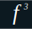

# Threat Surfaces

## **Multivariable Calculus for AI Security** | fischer³ Education

### Robert Fischer

---

**(Course Still in Active Development)**

This course builds the mathematical foundation for understanding how machine learning models behave, fail, and can be secured — starting from multivariable calculus and building toward the multivariate normal distribution, maximum likelihood estimation, and Bayesian inference.

It is designed for practitioners with demanding schedules. Every unit follows the same rhythm:

1. **Read** — concept notes with worked examples and a statistical bridge
2. **Compute** — live Python demonstrations you can run and modify
3. **Practice** — hand-worked exercises (PDF, available via the download link in each unit)
4. **Check** — solutions available via course portal

Each unit is **45–65 minutes** and is independently resumable.

---

## Course Modules

| # | Title | Focus |
|---|---|---|
| 00 | [Orientation & Prerequisites](modules/module-00-orientation/index) | Vectors, dot products, notation |
| 01 | [Geometry of $\R^n$](modules/module-01-geometry-of-rn/index.md) | Scalar fields, level sets, geometric intuition |
| 02 | [Partial Derivatives & Differentiability](modules/module-02-partial-derivatives/) | Partials, chain rule, total differential |
| 03 | [The Gradient & Directional Derivatives](modules/module-03-gradient-and-directional/) | Gradient fields, Jacobian, steepest ascent |
| 04 | [Optimization in Multiple Variables](modules/module-04-optimization/) | Critical points, Hessian, Lagrange multipliers |
| 05 | [Multiple Integrals](modules/module-05-multiple-integrals/) | Iterated integrals, coordinate systems |
| 06 | [The Multivariate Normal (Capstone)](modules/module-06-mvn-capstone/) | MVN from first principles |
| 07 | [Vector Calculus](modules/module-07-vector-calculus/) | Divergence, curl, major theorems |
| 08 | [Capstone Project](modules/module-08-capstone-project/) | Bayesian logistic regression end-to-end |

## Statistical Threads

Every module connects calculus to one or more of four statistical threads:

- **[PD]** Probability distributions & expectation
- **[MLE]** Maximum likelihood estimation
- **[BAY]** Bayesian inference
- **[GLM]** Multivariate regression & GLMs

---

*fischer³ Education · [GitHub](https://github.com/fischer3-net/juptyer-threat-surfaces)*
